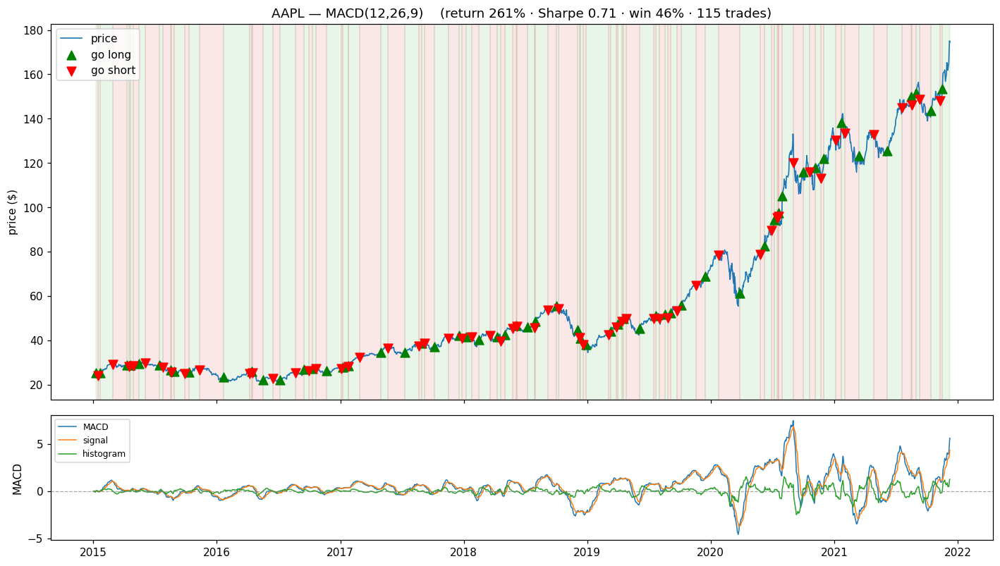

# momentum-signal-scanner

A **momentum-indicator (RSI / MACD) long-short signal scanner**. It backtests a
universe of stocks against a set of technical strategies, then ranks every
`(ticker, strategy)` combination by **risk-adjusted return**, not by win rate —
because, as the results below show, those two can point in opposite directions.

> **Background:** this scanner is my own clean-room reimplementation of
> momentum / technical-signal research I first explored during a quantitative
> trading internship in 2022. It is built from scratch on public market data —
> **no proprietary code, data, or strategy** — as a way to re-learn the concepts
> and demonstrate them end to end. See [Background & what I learned](#background--what-i-learned).



## The headline result: why ranking matters

Scanning 8 mega-caps × {RSI, MACD} over 2015–2021:

| ticker | strategy | total return | **Sharpe** | **win rate** | expectancy |
|--------|----------|-------------:|-----------:|-------------:|-----------:|
| AAPL | MACD | **+261%** | **0.71** | 46% | +0.013 |
| TSM  | RSI  | **−57%**  | −0.35 | **88%** | −0.005 |
| MSFT | RSI  | −75% | −0.69 | 75% | −0.062 |

Read those middle two columns. **TSM's RSI strategy won 88% of its trades and
still lost 57% of capital** — many small wins, a few large losses (negative
*expectancy*). **AAPL's MACD won under half its trades yet returned +261%** — its
winners dwarfed its losers. The original project ranked by win rate, which would
have crowned the 88%-win-rate *loser*. Ranking by Sharpe + expectancy puts the
table the right way up.

## Quickstart

```bash
pip install -e ".[dev]"     # or: pip install numpy pandas matplotlib pytest
python main.py              # scan the cached universe, write results, plot top combos
python -m pytest            # 14 offline, deterministic tests
python main.py --refresh    # re-pull the universe live (needs `pip install -U yfinance`)
```

## Background & what I learned

The idea for this scanner grew out of a quantitative trading internship in 2022,
where I first researched momentum / trend-following strategies built on technical
indicators. **Everything here is my own from-scratch rebuild on public data** — it
reproduces the *method* I learned, not any employer's code, data, or strategy.

**The research process the scanner automates:**

```
define universe  →  compute indicators (RSI / MACD)  →  generate long/short signals
      →  backtest each (ticker × strategy)  →  rank by risk-adjusted return  →  shortlist
```

(Pick a universe and period, split in-sample vs out-of-sample, backtest every
combination, score them on Sharpe / win rate / drawdown, and shortlist the
strongest.)

**The three lessons I actually took away:**

1. **The thesis and the data disagreed — honestly.** The strategy was *designed*
   as trend-following momentum (buy strength, sell weakness), yet when I
   grid-searched combinations, the best-ranked results often came from **RSI — a
   mean-reverting, counter-trend indicator.** "Trend-following design, mean-reverting
   winner" was the most interesting tension: no indicator is universally right, and
   the backtest doesn't have to agree with your story.
2. **RSI alone whipsaws in trends.** It fired counter-trend entries during clean
   trends and bled on them — which led to the idea of using **MACD as a trend
   filter** to veto RSI's worst trades (a mean-reverting signal gated by a trend one).
3. **Win rate is not enough** (the lesson this repo is built around): a strategy
   can win most of its trades and still lose money. That's why the scanner ranks by
   **Sharpe and expectancy**, not hit rate — see the headline result above.

## How it works

```
scanner/
  config.py      portable settings (no hardcoded paths), universe, costs
  data.py        load the price panel, offline-first cache
  indicators.py  hand-rolled RSI (Wilder) + MACD — no TA-Lib
  strategy.py    Strategy ABC + RSI/MACD — stateless & self-describing (LSP)
  backtest.py    lookahead-safe simulate() + the scanning engine
  metrics.py     Sharpe, drawdown, per-trade win rate & expectancy
  plotter.py     strategy-agnostic plotting (no isinstance)
  results.py     one clean ranked CSV
```

A strategy is a single class that declares four things — its `label`, the
indicators it needs, how to turn them into a `+1/-1/0` position, and how to plot
itself. The engine and plotter consume that interface and never name a concrete
strategy, so **adding a new strategy is one new class and zero edits elsewhere.**

## What I changed in the refactor

This is the part I'm proudest of — taking rusty code and making it defensible:

| Problem in the 2022 version | Fix |
|---|---|
| **Wouldn't run** — `main.py` imported `from strategies`/`from backtester` (wrong names) and built strategies with `asset=None`, crashing on construction | Stateless strategies; correct, working orchestration |
| **Lookahead bias** — entered a trade at the *same* close that generated the signal | One-bar execution lag: `position.shift(1) * return` |
| **Win-rate-only ranking** — hid losing strategies behind high hit rates | Rank by Sharpe; report expectancy & drawdown too |
| **Liskov/OCP violation** — the Plotter used `isinstance(strategy, …)` to decide what to draw | Strategies are self-describing via `panels()`; the Plotter is type-agnostic |
| **Dead on modern libs** — `DataFrame.append` (removed in pandas 2.0); relied on `'Adj Close'` (gone in current yfinance) | Modern pandas; current yfinance with MultiIndex handling |
| **Not portable** — hardcoded `/Users/...` output path, TA-Lib C dependency | Repo-relative paths; hand-rolled indicators (pandas only) |

## Known limitations & biases

- **In-sample, no train/test split.** Parameters are textbook defaults, but
  there's no out-of-sample validation — read the numbers as descriptive.
- **Simple technical signals mostly lose here.** Over 2015–2021 most combos have
  negative Sharpe, and even the best (AAPL MACD) trails AAPL buy-and-hold. That's
  honest, and the point: the value is the *framework and the ranking discipline*,
  not a magic strategy.
- **Flat per-turnover cost model** — no spread/slippage/impact.
- **Survivorship** — the universe is names that did well; a real study needs a
  point-in-time universe including delistings.

## License
MIT — see `LICENSE`.
